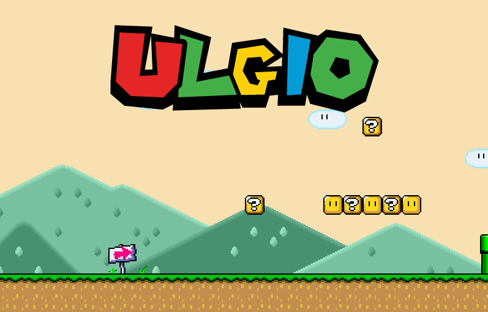

# ULGio

<!-- Add picture ulg.png below -->

## Introduction

J'ai réalisé ce jeu en 2018 dans le cadre du cours "Premier Projet d'Informatique" à l'Université de Liège.
Le code est monolithique, mal documenté, et il y a de la complexité cubique par-ci par-là, donc c'est à prendre avec des pincettes si vous voulez le réutiliser...
Mais il fonctionne, et c'est marrant de se battre avec le boss final.
Cela dit, vous pouvez en faire ce que vous voulez, bon amusement !

*Pour lancer le jeu :* `python3 jeu.py`

## Dépendances
- Python 3.x
- Pygame
- Peut-être d'autres, mais voyez en fonction du message d'erreur, je n'ai pas le temps de creuser là-dedans :-)

## Notes utiles :
Voici quelques notes que j'avais prises avant de soumettre le projet à l'époque...

### Niveau, map et tiles

  Le jeu fonctionne grâce à un système de "tiles".
  Il y a un tableau 2D dans lequel chaque case correspond à un bloc de 32*32px dans le jeu.
  Par exemple, dans le tableau, 1 correspond au sol, 0 au vide, 2 à un bloc-surprise, 4 à un Goomba, etc...

### Histoire, "étapes"

  Afin de faire quelques petites animations et une transition entre les deux niveaux, j'ai utilisé des "étapes" (monde.etape)
  dispersées un peu partout dans le code (note Lev 2022: c'est pas très propre ça, Lev). Une étape en précède une autre, et à chaque étape, une action différente
  est effectuée ; ça peut être le pilier (le tronc) qui vient bloquer l'entrée de la map #2, ou bien l'apparition de FLAPPY.
  Les changements de musiques, de bruitages, etc.

### Scrolling

  Une variable "scroll" est utilisée pour décaler la surface contenant la map + les entités selon l'axe X lorsque le joueur est
  au milieu de la fenêtre et qu'il avance.

### Oeufs et Flappy

  Pour vaincre Flappy, il faut lui *lancer ses oeufs dessus* (oeufs qu'on ramasse en appuyant sur MAJ). Ils le frappent alors en retombant.
  Il faut faire attention à ne pas entrer en collision avec lui !

### Debug

  Des outils de debugging sont aussi disponibles, il suffit de mettre monde.debug à True.

### Bugs signalés
- Selon l'OS et la machine, il est possible que le système de collisions soit foireux et que le personnage tombe dans le sol. Désolé, c'est à Lev-2018 qu'il faut en vouloir !